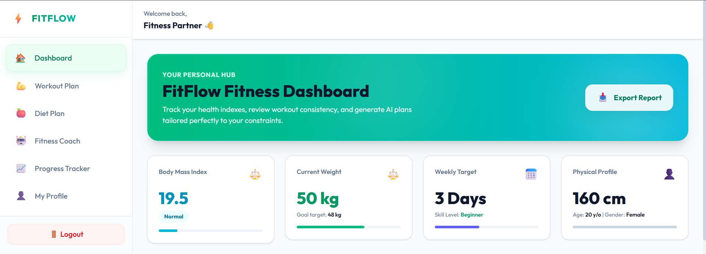
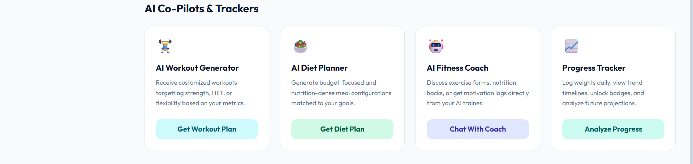
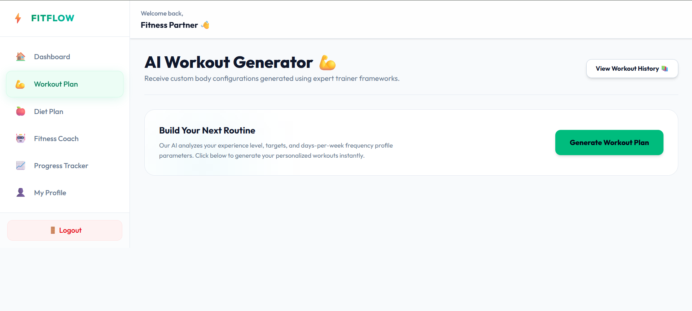
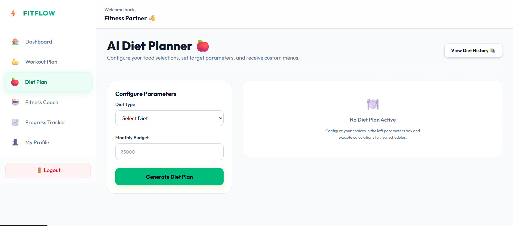
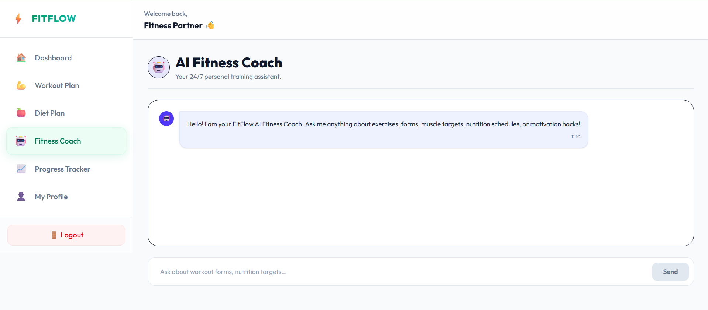
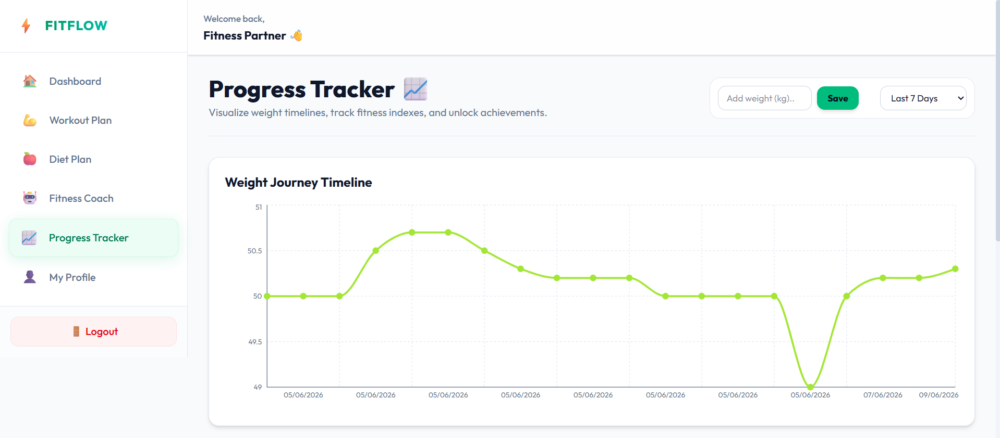
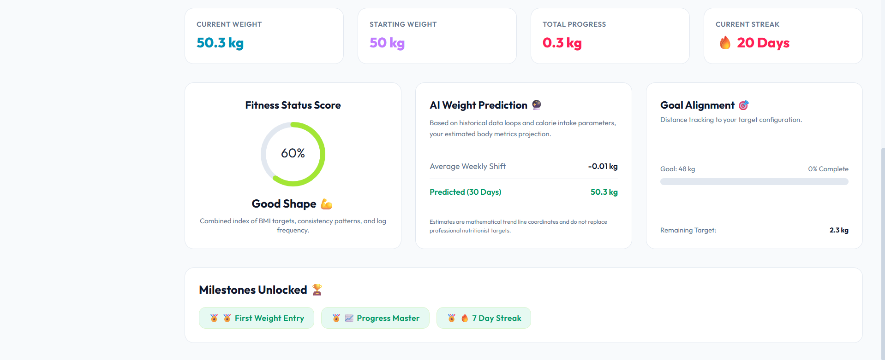

# 🏋️ FitFlow – AI Personal Fitness Coach

FitFlow is a full-stack AI-powered fitness platform that helps users achieve their health and fitness goals through personalized workout plans, AI-generated diet recommendations, progress tracking, and an intelligent fitness assistant.

---
  
## 🚀 Features

### 🔐 Authentication & User Management

* User Signup & Login
* JWT Authentication
* Protected Routes
* User Profile Management

### 💪 AI Workout Planner

Generate personalized workout plans based on:

* Weight
* Height
* Age
* Fitness Goal
* Experience Level

Features:

* AI-generated workout recommendations
* Personalized exercise schedules
* Workout history tracking

### 🥗 AI Diet Planner

Generate customized diet plans based on:

* Vegetarian Diet
* Non-Vegetarian Diet
* Vegan Diet

Features:

* Budget-based meal recommendations
* Personalized nutrition guidance
* Diet history tracking

### 🤖 AI Fitness Assistant

An AI-powered chatbot that helps users with:

* Workout suggestions
* Nutrition advice
* Fitness-related questions
* General health recommendations

Powered by OpenRouter AI Models.

### 📈 Progress Tracker

Track your fitness journey with:

* Weight Monitoring
* BMI Analysis
* Fitness Score Calculation
* Goal Progress Tracking
* Weight Prediction Analytics
* Achievement Badges
* Interactive Progress Charts

### 📚 History Management

* Workout Plan History
* Diet Plan History
* Quick access to previously generated plans

### 🎨 Modern UI/UX

* Fully Responsive Design
* Smooth Page Transitions
* Toast Notifications
* Particle Background Effects
* Mobile-Friendly Experience

---

## 🛠️ Tech Stack

### Frontend

* React.js
* React Router DOM
* Tailwind CSS
* Framer Motion
* Recharts
* Axios
* React Hot Toast

### Backend

* Node.js
* Express.js
* MongoDB
* Mongoose
* JWT Authentication

### AI Integration

* OpenRouter API
* Google Gemma Models

---

## 📂 Project Structure

```bash
FitFlow/
│
├── frontend/
│   ├── src/
│   │   ├── assets/
│   │   ├── pages/
│   │   ├── components/
│   │   ├── services/
│   │   ├── routes/
│   │   └── App.jsx
│   │
│   └── package.json
│
├── backend/
│   ├── controllers/
│   ├── middleware/
│   ├── models/
│   ├── routes/
│   ├── config/
│   └── server.js
│
├── README.md
└── .gitignore
```

---

## ⚙️ Installation

### Clone Repository

```bash
git clone https://github.com/vanshikazawar27/fitflow.git
cd fitflow
```

### Backend Setup

```bash
cd backend
npm install
```

Create a `.env` file inside the backend directory:

```env
PORT=5000

MONGO_URI=your_mongodb_connection_string

JWT_SECRET=your_jwt_secret

OPENROUTER_API_KEY=your_openrouter_api_key
```

Run Backend:

```bash
npm run dev
```

### Frontend Setup

```bash
cd frontend
npm install
```

Install additional packages if needed:

```bash
npm install framer-motion react-hot-toast recharts axios
```

Run Frontend:

```bash
npm run dev
```

---

## 🌐 Environment Variables

### Backend (.env)

```env
PORT=5000
MONGO_URI=
JWT_SECRET=
OPENROUTER_API_KEY=
```

---

## 📸 Screenshots













---

## 🎯 Future Enhancements

* Exercise Library API Integration
* Progress Photo Uploads
* AI Meal Scanner
* Voice-Based AI Fitness Coach
* Wearable Device Integration
* Fitness Challenges & Leaderboards
* Social Fitness Community
* Smart Goal Recommendations

---

## 🤝 Contributing

Contributions are welcome!

1. Fork the repository
2. Create your feature branch

```bash
git checkout -b feature-name
```

3. Commit your changes

```bash
git commit -m "Add feature"
```

4. Push to the branch

```bash
git push origin feature-name
```

5. Open a Pull Request

---


Thanks 

---


